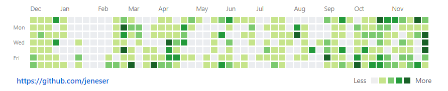

## 王亚哲
**Web前端开发实习生**

    

> 网络工程专业，本科，2019年毕业。
> Phone:`18839130035` Email:`jeneserwang@gmail.com`

-------------

#### 专业技能
- 掌握Web前端开发基本技能。了解`W3C`标准，前端`语义化`，前端`安全`等。懂些`审美`，重视`用户体验`及代码`可维护`性。
- 对`CSS`样式重用，`模块抽象`有一定的实践与深思，包括不仅限于`SMACSS`, `OOCSS`。
- 对前端`工程化`，`性能优化`，`ES6`，`MV*`框架，`NodeJs`有着较多的实践与较深刻的感悟。
- 熟练使用`Git`管理维护项目。有`Hybrid`实践，对服务端`架构`以及容器化技术`Docker`感兴趣。

#### 项目经验

- **Github Star 1.1k+ douban移动端**
`Vuejs`全家桶项目。在社区缺少相关实战`Demo`的情况下，动手开发了本项目。截至目前项目已在`Github`上收获`1.1k+` star和`360+` fork。
 
- **Vue-scroll-behavior插件**
在实践`Vuejs`过程中遇到的关于`hash`模式下页面滚动位置记录问题，开发了以`Vue-router`生命周期钩子为基础的轻量级页面滚动位置管理的`npm`包`vue-scroll-behavior`。
 
- **Github Star 100+ ionic-super-bar**
`Ionic`跨终端实践中，为实现`Material Design`，解决Ionic `Android`平台关于实现透明状态栏的问题。其主要技术点为`TypeScript`和 `SCSS`。Ionic团队成员star过本项目。
 
- **Wehpu河南理工大学微信小程序**
为了解决同学们无法直接访问内网的问题，`设计`并`开创性`的开发了Wehpu小程序。其后端核心是`爬虫`，采用`Express`做`RESTful API`系统，并基于`Docker`构建，`HAproxy`做负载均衡，方便部署的同时保证系统`鲁棒性`。其间解决教务系统`SSL VPN`中`RSA`加密问题，并发布`rsa-node` `npm`包。`Tesseract`解决验证码自动识别问题。正式发布后将极大方便同学们的日常生活，预估服务师生逾`万人`。

